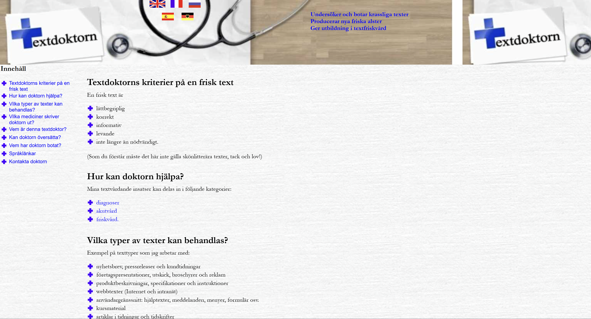
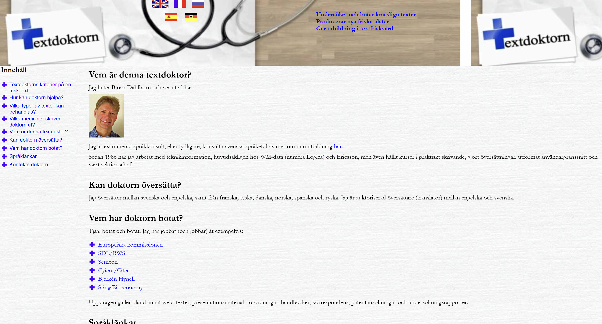
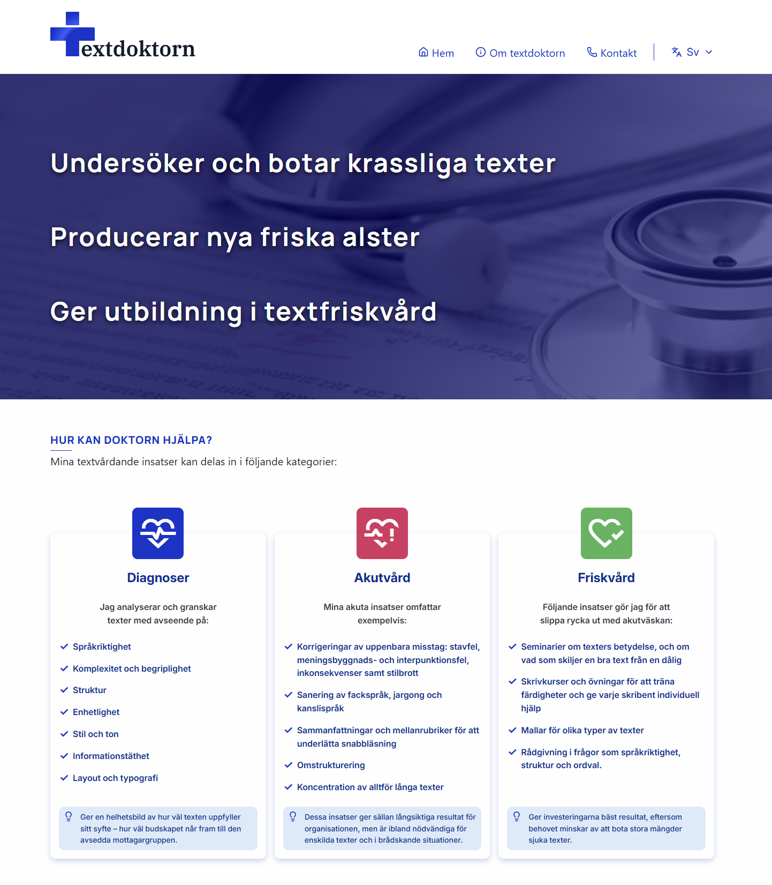
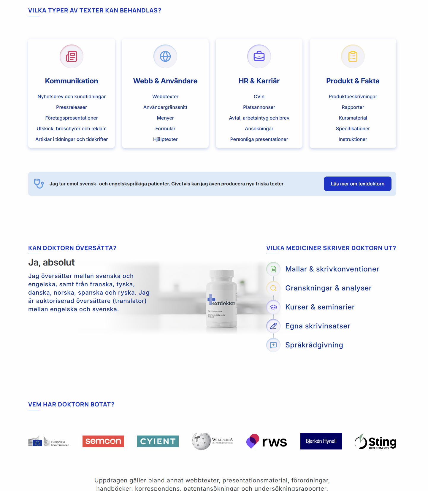
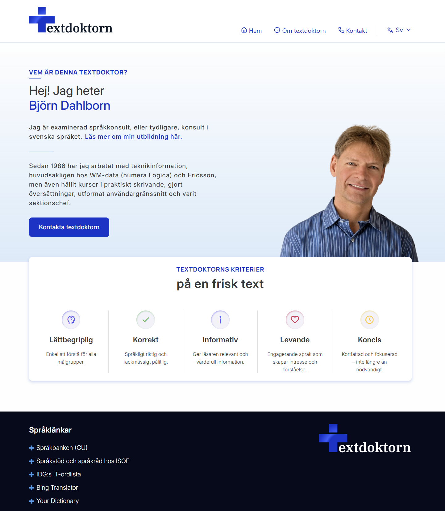
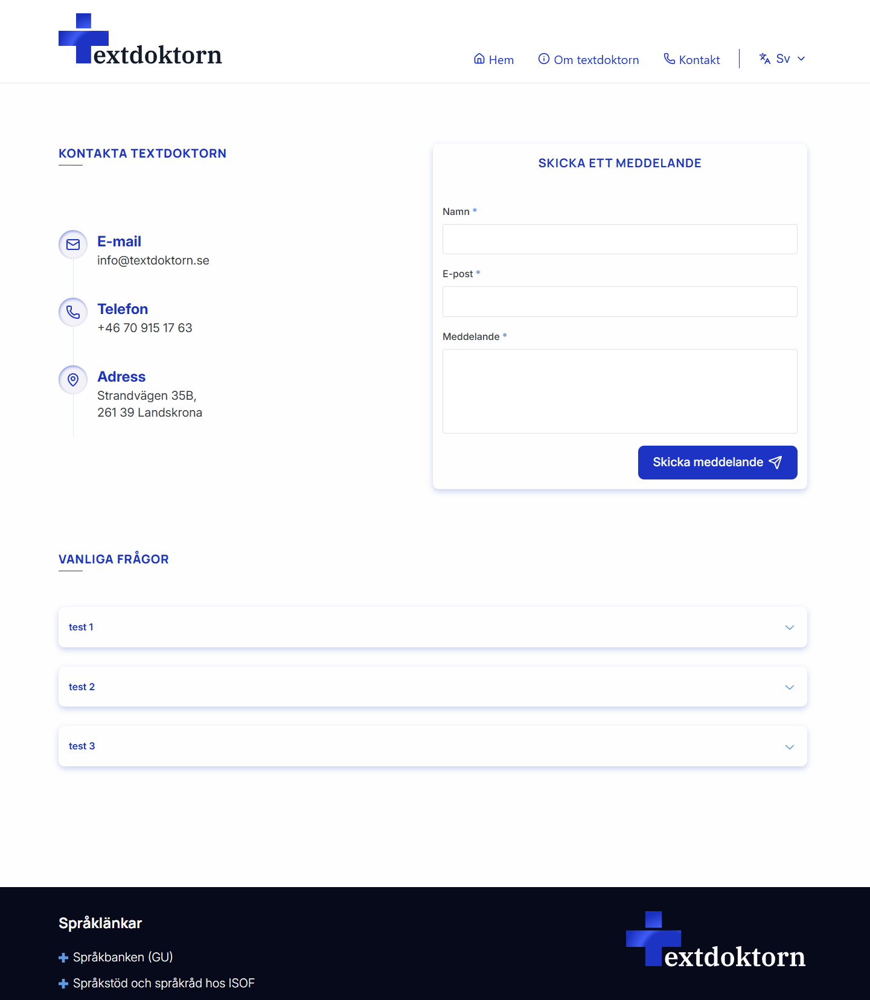
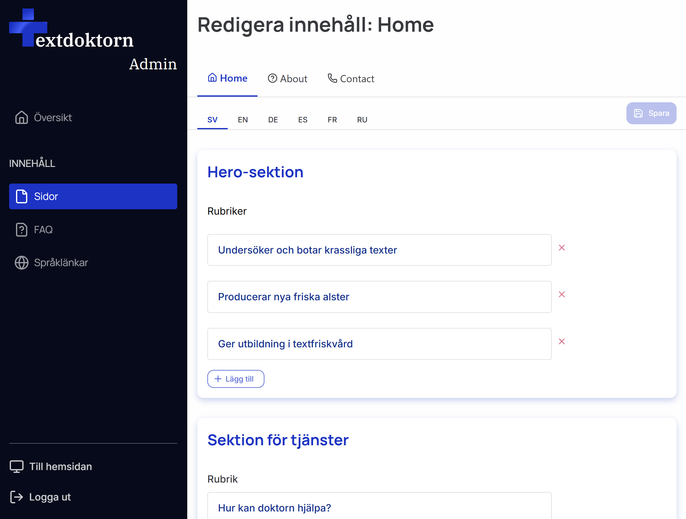
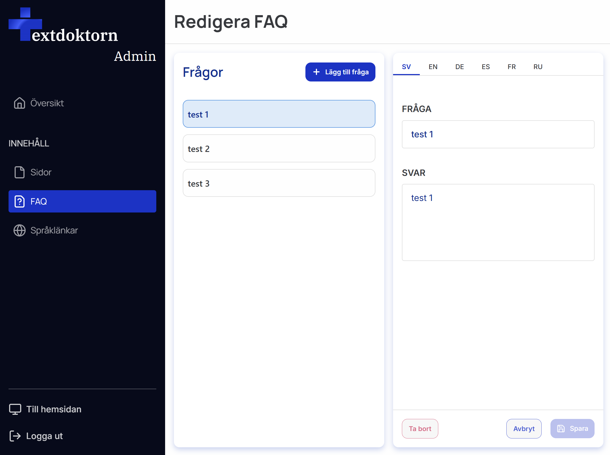

# Textdoktorns webbmottagning 🚧 Pågående utveckling

En modernisering och vidareutveckling av Textdoktorns befintliga webbplats.

Projektet började som en statisk webbplats som jag byggde om till en fullstack-applikation med **React, Node.js, Express och MongoDB**. Fokus har varit att modernisera designen, förbättra användarupplevelsen och samtidigt skapa en lösning där innehållet kan administreras utan att behöva ändra direkt i källkoden.

---

## Före & efter

En stor del av projektet har varit att modernisera den befintliga webbplatsens design och struktur.

**Live-versioner:**

- 🌐 [Befintlig webbplats](https://textdoktorn.se/)
- 🚧 [Utvecklingsversion](https://textdoktorn-dev.netlify.app/sv)

### Före

<table>
  <tr>
    <td></td>
    <td></td>
  </tr>
</table>

### Efter

<table>
  <tr>
    <td></td>
    <td></td>
  </tr>
  <tr>
    <td></td>
    <td></td>
  </tr>
</table>

---

## Om projektet

Den ursprungliga Textdoktorn-webbplatsen var en äldre, statisk webbplats. Syftet med projektet har varit att modernisera webbplatsen både visuellt och tekniskt.

Den nya versionen är byggd med React på frontend och Node.js/Express på backend. Innehållet lagras i MongoDB och kan administreras genom en separat adminpanel.

Det innebär bland annat att innehåll på webbplatsen kan uppdateras utan att källkoden behöver ändras.

---

## Projektets syfte

Projektet har haft två huvudsakliga syften:

- Att modernisera och förbättra Textdoktorns befintliga webbplats.
- Att få praktisk erfarenhet av att bygga en fullstack-applikation där frontend, backend och databas samverkar.

Jag är medveten om att den här typen av webbplats hade kunnat byggas med en betydligt enklare arkitektur utan en egen backend och databas.

Den valda lösningen är därför delvis ett medvetet tekniskt val för att ge projektet ett större omfång och skapa möjlighet att praktiskt arbeta med bland annat **REST API, autentisering, databashantering och kommunikation mellan frontend och backend**.

Även om en enklare lösning hade varit tillräcklig för webbplatsens grundläggande behov har projektet gett mig möjlighet att fördjupa mina kunskaper inom fullstack-utveckling.

---

## Funktioner

- Responsiv design för desktop, tablet och mobil
- Flerspråkighet
- Språkväxling mellan svenska, engelska, tyska, spanska, franska och ryska
- Adminpanel
- Administratörsinloggning
- JWT-baserad autentisering
- Redigering av sidinnehåll
- FAQ
- Kontaktformulär
- SEO-anpassade sidtitlar och beskrivningar
- Animeringar och interaktiva komponenter
- REST API
- MongoDB-databas

---

## Tekniker

### Frontend

- React
- JavaScript
- React Router
- Zustand
- React Hook Form
- Axios
- i18next
- Motion
- Lucide
- CSS
- Vite

### Backend

- Node.js
- Express
- MongoDB
- Mongoose
- JWT
- bcrypt
- Resend

### Verktyg & tjänster

- Git
- GitHub
- VS Code
- Figma
- Netlify
- Railway
- MongoDB Atlas

---

## Arkitektur

Applikationen är uppdelad i en frontend och en backend som kommunicerar via ett REST API.

```text
┌─────────────────────┐
│                     │
│       React         │
│      Frontend       │
│                     │
└──────────┬──────────┘
           │
           │ HTTP / REST API
           ▼
┌─────────────────────┐
│                     │
│   Node.js / Express │
│       Backend       │
│                     │
└──────────┬──────────┘
           │
           │ Mongoose
           ▼
┌─────────────────────┐
│                     │
│     MongoDB Atlas   │
│      Database       │
│                     │
└─────────────────────┘
```

---

## Frontend

Frontend är byggd med React och består av återanvändbara komponenter och sidor.

React Router används för navigation och språk ingår i URL-strukturen.

Exempel:

```text
/sv
/en
/de
/es
/fr
/ru
```

**Zustand** används för state management, bland annat för autentisering och hantering av sidinnehåll.

**Axios** används för kommunikation med backendens API.

**React Hook Form** används för formulärhantering och **i18next** används för att hantera projektets olika språk.

---

## Flerspråkighet

Webbplatsen finns på sex olika språk:

- 🇸🇪 Svenska
- 🇬🇧 Engelska
- 🇩🇪 Tyska
- 🇪🇸 Spanska
- 🇫🇷 Franska
- 🇷🇺 Ryska

Språkhanteringen är implementerad med **i18next** och språket inkluderas även i URL:en.

Det gör det möjligt att ha separata URL:er för respektive språkversion.

---

## Adminpanel

En av de större funktionerna i den nya applikationen är en separat adminpanel.

Administratören kan logga in och redigera innehållet på webbplatsen utan att behöva ändra direkt i källkoden.

Adminpanelen används bland annat för att hantera:

- Startsidan
- Om Textdoktorn
- Kontaktsidan
- FAQ

<table>
  <tr>
    <td></td>
    <td></td>
  </tr>
</table>

Ändringar som görs i adminpanelen sparas via backendens API och lagras i MongoDB.

---

## Autentisering

Adminpanelen är skyddad med JWT-baserad autentisering.

Vid inloggning verifieras användarens uppgifter av backend. Vid lyckad autentisering returneras en JWT som används vid API-anrop som kräver behörighet.

Lösenord hash:as med **bcrypt** och lagras inte i klartext.

På så sätt kan administrativa funktioner skyddas från obehörig åtkomst.

---

## Databas

Projektet använder **MongoDB Atlas** som databas och **Mongoose** för att kommunicera med databasen från backend.

Tidigare var webbplatsens innehåll statiskt. I den nya lösningen lagras innehållet istället i databasen.

Det gör att innehåll kan ändras genom adminpanelen utan att frontend-koden behöver modifieras.

---

## Kontaktformulär

Kontaktformuläret skickar information till backend där meddelandet hanteras.

För e-postleveransen används **Resend**.

Det innebär att frontend inte behöver hantera själva e-postleveransen direkt, utan kommunikationen sker via backend.

---

## SEO

SEO har implementerats med hjälp av **React Helmet** och språkbaserade metadata.

De olika språkversionerna kan ha egna:

- Sidtitlar
- Meta descriptions

Det gör att metadata kan anpassas efter respektive språkversion av webbplatsen.

---

## Deployment

Applikationens olika delar är deployade separat.

| Del      | Tjänst        |
| -------- | ------------- |
| Frontend | Netlify       |
| Backend  | Railway       |
| Databas  | MongoDB Atlas |

Frontend kommunicerar med backend via en environment variable:

```env
VITE_API_URL=<backend-url>
```

Känsliga uppgifter som databasanslutning och JWT-secret lagras som environment variables och finns inte i repositoryt.

---

## Vad jag har lärt mig

Projektet har gett mig praktisk erfarenhet av att utveckla en fullstack-applikation och av att koppla samman flera olika delar av en applikation.

Under projektet har jag bland annat arbetat med:

- React och komponentbaserad utveckling
- REST API
- Node.js och Express
- MongoDB och Mongoose
- JWT-autentisering
- bcrypt
- CRUD-operationer
- State management med Zustand
- Formulärhantering
- Flerspråkighet
- Responsiv design
- SEO
- Environment variables
- Deployment

En stor del av projektet har också handlat om problemlösning och att förstå hur frontend, backend, autentisering och databas ska samverka på ett strukturerat sätt.

---

## Sammanfattning

Textdoktorn har utvecklats från en äldre statisk webbplats till en modern fullstack-applikation.

Den nya lösningen kombinerar en modern React-baserad frontend med ett eget REST API, MongoDB och en administrativ panel för hantering av webbplatsens innehåll.

Projektet har framför allt varit ett sätt att kombinera ett verkligt webbprojekt med praktisk träning inom fullstack-utveckling och att få erfarenhet av hur frontend, backend och databas kan byggas ihop till en sammanhängande applikation.
